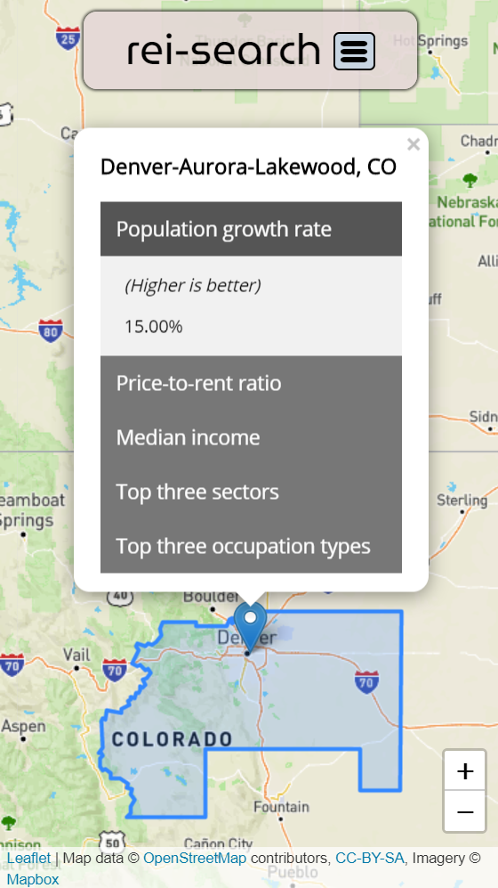
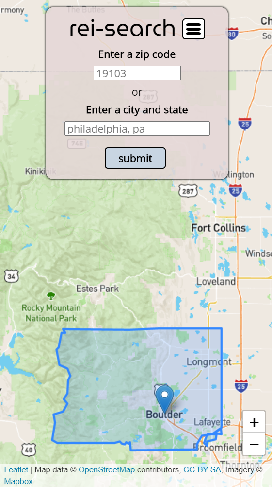

# rei-search

## About the rei-search app

Real estate investment decisions should always begin with due diligence in order to stack the deck in your favor. Even before you decide on the type of real estate you wish to invest in, you should know the details about where you will invest.

### Metropolitan Statistical Areas
This app focuses on discovering details about metropolitan statistical areas (MSAs), which are geographic regions centered around areas of high population density (i.e., big cities) and integrated economies. Statistics about the population and economy of MSAs in the geography you wish to invest are important to consider if you want to be successful as an investor.

There are 392 (as of 2020) MSAs in the United states, and you can explore key statistical information about each of them with this app.

## Live app
- [rei-search](https://bradrivenburgh.github.io/rei-search/)

## Screenshots
### Landing screen

### Responsive mobile-first design
| --- | --- |
| |  |

### Discover and explore MSAs

### Get key statistics 

## How to run
- Clone the repository
- Open the index.html file in a browser of your choice

## Technologies used
- HTML
- CSS
- JavaScript
- JQuery
- LeafletJS
- CitySDK

## Planning
- [Project board](https://github.com/users/bradrivenburgh/projects/1)